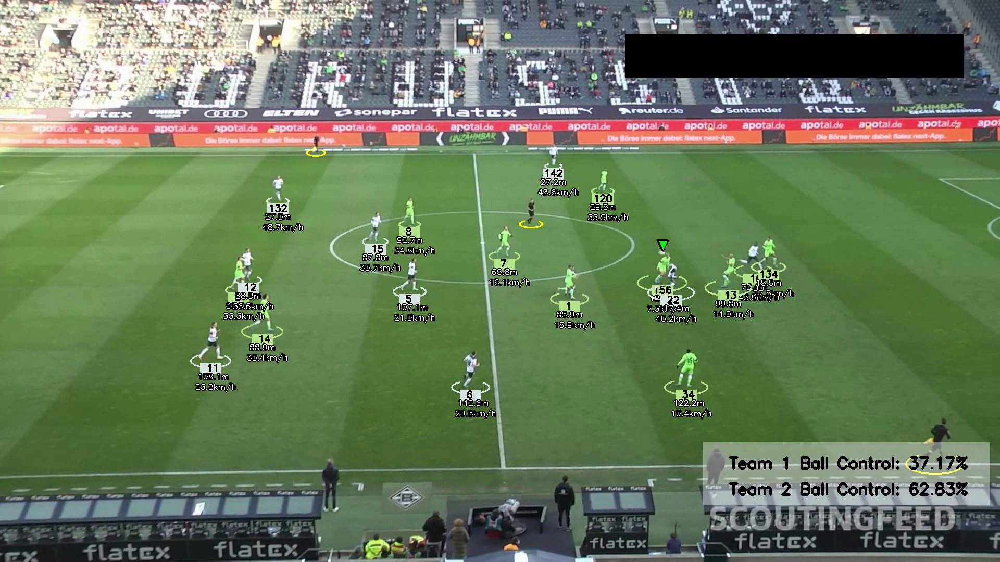

# ⚽ Football Analysis & Player Tracking System

[](https://www.python.org/downloads/)
[](https://opensource.org/licenses/MIT)
[](https://opencv.org/)
[](https://github.com/ultralytics/ultralytics)

A comprehensive AI-powered football analysis system that tracks players, ball, and referees in real-time, providing detailed analytics including player movements, speeds, distances, and team ball possession statistics.

## ✨ Features

- **🎯 Object Detection & Tracking**: YOLO-based detection with ByteTrack for consistent player, ball, and referee tracking
- **👥 Team Assignment**: Automatic team identification using K-means clustering on jersey colors
- **⚡ Speed Calculation**: Real-time speed tracking for each player (km/h)
- **📏 Distance Tracking**: Cumulative distance traveled by each player (meters)
- **⚽ Ball Possession**: Frame-by-frame ball possession detection and team control statistics
- **🔄 Ball Interpolation**: Smooth ball tracking even during occlusions
- **📊 Visual Analytics**: Rich visualization with player IDs, team colors, stats overlay
- **💾 Caching System**: Stub-based caching for fast reprocessing

## 🎬 Demo



*Example output showing player tracking with IDs, distance traveled, speed, team colors, and ball possession indicators*

## 🚀 Quick Start

### Prerequisites

- Python 3.8 or higher
- Virtual environment (recommended)

### Installation

1. **Clone the repository**
```bash
git clone https://github.com/AhmedHassan1722/Football_Analysis.git
cd Football_Analysis
```

2. **Create and activate virtual environment**
```bash
python -m venv FB
# On Windows
FB\Scripts\activate
# On Linux/Mac
source FB/bin/activate
```

3. **Install dependencies**
```bash
pip install -r requirements.txt
```

4. **Download YOLO model**

Place your trained YOLO model (`best.pt`) in the `models/` directory. The model should be trained to detect:
- Players
- Goalkeepers
- Ball
- Referees

### Usage

1. **Place your video** in `input_videos/` directory

2. **Update video path** in `main.py`:
```python
video_frames = read_video('path/to/your/video.mp4')
```

3. **Run the analysis**
```bash
python main.py
```

4. **Find output** in `output_videos/output_video.avi`

## 📁 Project Structure

```
Football_Analysis/
├── main.py                      # Main pipeline orchestration
├── trackers/
│   └── tracker.py              # Object detection & tracking logic
├── team_assigner/
│   └── team_assigner.py        # Team color assignment
├── player_ball_assigner/
│   └── player_ball_assigner.py # Ball possession detection
├── utils/
│   ├── video_utils.py          # Video I/O utilities
│   └── bbox_utils.py           # Bounding box operations
├── models/                      # YOLO model files
├── input_videos/               # Input video directory
├── output_videos/              # Output video directory
├── stubs/                      # Tracking cache files
├── requirements.txt            # Python dependencies
└── README.md                   # This file
```

## ⚙️ Configuration

### Adjusting Parameters

**Frame Rate (FPS)**
```python
tracks = trackers.calculate_player_statistics(tracks, fps=24.0)
```

**Pixel-to-Meter Calibration**

To improve distance/speed accuracy, calibrate using a known field measurement:
```python
# Example: Penalty box width is 16.5m and measures 165 pixels
pixel_to_meter = 16.5 / 165  # = 0.1
tracks = trackers.calculate_player_statistics(tracks, pixel_to_meter=0.1)
```

**Stub Caching**

Enable/disable caching:
```python
tracks = trackers.get_object_tracks(
    video_frames,
    read_from_stub=True,  # Set False to reprocess
    stub_path='stubs/track_stubs.pkl'
)
```

## 📊 Output Features

The system generates annotated videos with:

- **Player Tracking**: Each player shown with:
  - Track ID number (in colored rectangle)
  - Team color (ellipse color)
  - Total distance traveled (e.g., "125.3m")
  - Current speed (e.g., "18.5 km/h")
  - Ball possession indicator (red triangle)

- **Ball Tracking**: Green triangle marker
- **Referee Tracking**: Yellow ellipses with track IDs
- **Team Statistics**: Real-time team ball control percentages

## 🧪 How It Works

### Processing Pipeline

1. **Object Detection**: YOLO detects players, ball, and referees in each frame
2. **Object Tracking**: ByteTrack maintains consistent IDs across frames
3. **Ball Interpolation**: Missing ball detections filled using pandas interpolation
4. **Position Tracking**: Player foot positions extracted from bounding boxes
5. **Statistics Calculation**: 
   - Distance: Accumulated pixel distances converted to meters
   - Speed: Frame-to-frame movement with 5-frame smoothing
6. **Team Assignment**: K-means clustering on player jersey colors
7. **Ball Possession**: Closest player to ball marked with possession
8. **Visualization**: All data overlaid on video frames

## 🔧 Technical Details

**Dependencies:**
- `ultralytics` - YOLOv8 object detection
- `supervision` - ByteTrack tracking algorithm
- `opencv-python` - Video processing and visualization
- `scikit-learn` - K-means clustering for team assignment
- `pandas` - Ball position interpolation
- `numpy` - Numerical operations

**Performance:**
- Batch processing (20 frames) for memory efficiency
- Stub caching for instant reprocessing
- Smoothing algorithms for stable visualizations

## 🤝 Contributing

Contributions are welcome! Please feel free to submit a Pull Request. For major changes, please open an issue first to discuss what you would like to change.

See [CONTRIBUTING.md](CONTRIBUTING.md) for guidelines.

## 📝 License

This project is licensed under the MIT License - see the [LICENSE](LICENSE) file for details.

## 🙏 Acknowledgments

- [Ultralytics YOLO](https://github.com/ultralytics/ultralytics) for object detection
- [Supervision](https://github.com/roboflow/supervision) for tracking algorithms
- OpenCV community for computer vision tools

## 📧 Contact

Ahmed Hassan - [@AhmedHassan1722](https://github.com/AhmedHassan1722)

Project Link: [https://github.com/AhmedHassan1722/Football_Analysis](https://github.com/AhmedHassan1722/Football_Analysis)

---

**Made with ⚽ and 🤖 by Ahmed Hassan**
